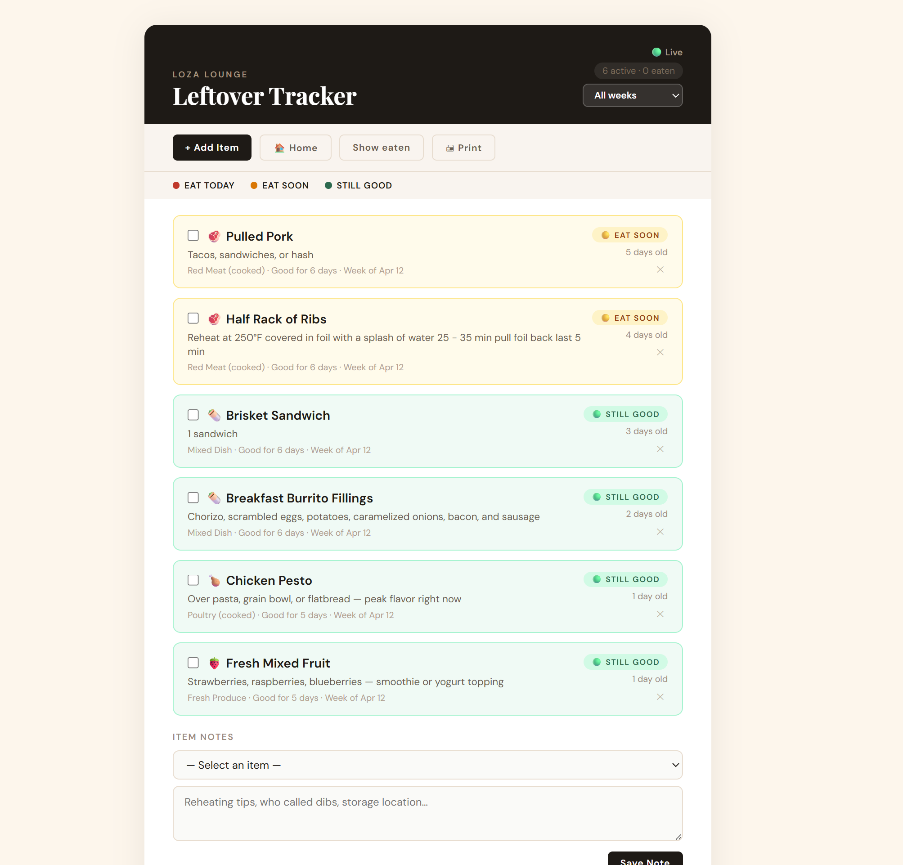

# 🔥 Loza Lounge

A real-time shared household tool built on Firebase + GitHub Pages.

## Current: Leftover Tracker

Track fridge leftovers with live sync across all household members. Anyone opens the link, checks off what got eaten, adds new items with food type and date — everyone sees it instantly.

**Features**
- Real-time sync via Firebase Realtime Database
- Food safety urgency system (🔴 Eat Today · 🟡 Eat Soon · 🟢 Still Good)
- Home vs Strict safety mode toggle (household-realistic vs restaurant-guideline shelf life)
- Per-item notes with shared sync
- Week filter to browse past entries
- Anonymous auth — no login required, bot-resistant
- Printable view
- Mobile friendly

---

## 💡 Vision: Restaurant Tool

The same core architecture scales into a professional kitchen inventory and food safety tool.

**Planned additions**
- AI chat interface — "what's expiring today, what should I 86 before service?"
- Auto-generated staff alerts for items hitting day 3+
- Multiple storage locations (walk-in, lowboy, dry storage, freezer)
- Quantity + par level tracking
- Prep date vs use-by date as separate fields
- Role-based access (chef, line cook, FOH manager)
- End-of-week waste reports
- Health code compliance mode as default

The AI layer turns a checklist into an actual kitchen assistant — a cook at 6am gets a plain-English briefing on what needs to move and what to build a special around.

---

## Setup

1. Clone the repo
2. Copy `config.example.js` to `config.js` and fill in your Firebase credentials
3. Enable Firebase Realtime Database and Anonymous Auth in your Firebase project
4. Set database rules to `auth != null` for read/write
5. Push to GitHub and enable GitHub Pages on the `main` branch

Your live URL: `https://<your-username>.github.io/<repo-name>`

---

## License

MIT License

Copyright (c) 2026 Ted Skorzewski III (AWH LLC)

Permission is hereby granted, free of charge, to any person obtaining a copy of this software and associated documentation files (the "Software"), to deal in the Software without restriction, including without limitation the rights to use, copy, modify, merge, publish, distribute, sublicense, and/or sell copies of the Software, and to permit persons to whom the Software is furnished to do so, subject to the following conditions:

The above copyright notice and this permission notice shall be included in all copies or substantial portions of the Software.

THE SOFTWARE IS PROVIDED "AS IS", WITHOUT WARRANTY OF ANY KIND, EXPRESS OR IMPLIED, INCLUDING BUT NOT LIMITED TO THE WARRANTIES OF MERCHANTABILITY, FITNESS FOR A PARTICULAR PURPOSE AND NONINFRINGEMENT. IN NO EVENT SHALL THE AUTHORS OR COPYRIGHT HOLDERS BE LIABLE FOR ANY CLAIM, DAMAGES OR OTHER LIABILITY, WHETHER IN AN ACTION OF CONTRACT, TORT OR OTHERWISE, ARISING FROM, OUT OF OR IN CONNECTION WITH THE SOFTWARE OR THE USE OR OTHER DEALINGS IN THE SOFTWARE.
